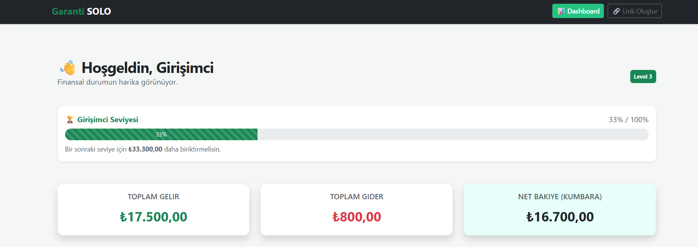
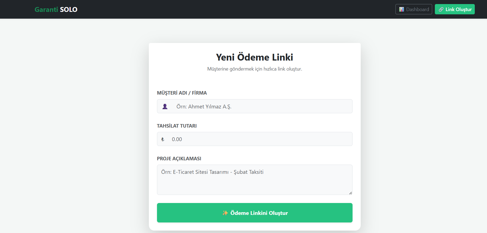
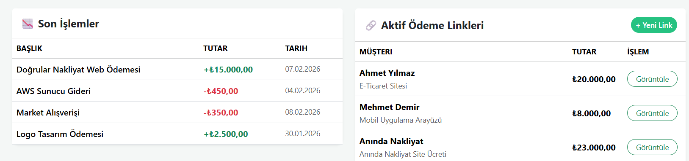

# 🚀 Garanti SOLO - Genç Girişimci Bankacılık Modülü


> **"Geleceğin Girişimcilerini Bugünden Kazanın."**

## 📖 Proje Hakkında

Bu proje, **Garanti BBVA "Fikrinle Parla" Hackathonu** kapsamında; üniversite öğrencileri ve genç freelancer'ların bankacılık deneyimini iyileştirmek amacıyla geliştirilmiştir.

Gençlerin sadece paralarını saklayan değil; onlara profesyonel ödeme alma altyapısı sunan (Link ile Ödeme), birikim yapmaya teşvik eden ve finansal okuryazarlıklarını **oyunlaştırma (gamification)** ile geliştiren yeni nesil bir "Girişimci Modu" tasarlanmıştır.

### 💡 Geliştirme Süreci & Teknoloji
Bu proje benim için teknik bir öğrenme yolculuğudur:
* **Backend:** İlk kez **ASP.NET Core Web API** mimarisini kullanarak RESTful servisler geliştirdim.
* **Frontend:** Modern **React.js** kütüphanesini kullanarak, API ile haberleşen dinamik bir arayüz tasarladım.
* **Veri Analizi:** Python (Pandas) kullanarak hackathon veri setini analiz ettim ve projemi "veri odaklı" stratejiler üzerine kurdum.

---

## 📸 Proje Görselleri

Uygulamanın çalışan ekran görüntüleri ve analiz çıktıları aşağıdadır:

### 1. Dashboard & Oyunlaştırma (Gamification)
*Kullanıcının gelir/gider takibi yaptığı ve birikim yaptıkça Level atladığı (XP kazandığı) ana ekran.*



### 2. Freelancer Ödeme Linki Oluşturma
*Girişimcinin müşteri adı ve tutar girerek saniyeler içinde profesyonel ödeme linki oluşturduğu modül.*



### 3. Stratejik Veri Analizi (Python)
*Kampanya verimliliklerini ölçtüğümüz ve stratejimizi belirleyen veri analizi grafiği.*



---

## ✨ Temel Özellikler

### 🔗 Freelancer Ödeme Sistemi (Link ile Ödeme)
Genç girişimcilerin şirket kurmadan, profesyonel bir şekilde ödeme almasını sağlar.
* Kullanıcı, IBAN paylaşmak yerine müşterisine özel ödeme sayfası linki üretir.
* Örn: `garanti-solo.com/pay/123`

### 🎮 Finansal Oyunlaştırma (Level Sistemi)
Gençleri tasarrufa teşvik etmek için sisteme "Level Bar" entegre edilmiştir.
* Kullanıcı harcama yaptıkça değil, **Net Birikim** yaptıkça XP kazanır.
* Hedefe yaklaştıkça bar dolar ve kullanıcı bir üst seviyeye (Örn: Girişimci Seviyesi 5) geçer.

---

## 🛠️ Kullanılan Teknolojiler

| Alan | Teknoloji | Açıklama |
| :--- | :--- | :--- |
| **Backend** | C# / ASP.NET Core 8.0 | REST API, Controller yapısı, Mock Data Service. |
| **Frontend** | React.js | Component bazlı mimari, Hooks (useState, useEffect). |
| **Styling** | Bootstrap 5 | Responsive tasarım, Garanti BBVA kurumsal renk paleti. |
| **Data** | In-Memory (Mock) | Hackathon süresi kısıtlı olduğu için RAM tabanlı veri simülasyonu. |
| **Analiz** | Python (Pandas) | Stratejik kampanya analizi ve verimlilik raporlaması. |

---

## 🚀 Kurulum ve Çalıştırma

Projeyi yerel ortamınızda çalıştırmak için aşağıdaki adımları izleyin:

### 1. Backend'i Ayağa Kaldırın (.NET)
Terminalde backend proje dizinine gidin:
```bash
cd GarantiWebApi
dotnet run
